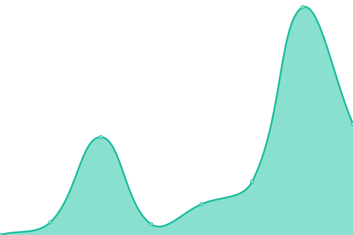

# [📈 Live Status](https://status.jonnyislandhosting.net): <!--live status--> **🟧 Partial outage**

This repository contains the open-source uptime monitor and status page for [JonnyIslandNetwork](https://jonnyisland.net), powered by [Upptime](https://github.com/upptime/upptime).

With [Upptime](https://upptime.js.org), you can get your own unlimited and free uptime monitor and status page, powered entirely by a GitHub repository. We use [Issues](https://github.com/JonnyIslandNetwork/status-page/issues) as incident reports, [Actions](https://github.com/JonnyIslandNetwork/status-page/actions) as uptime monitors, and [Pages](https://status.jonnyislandhosting.net) for the status page.

<!--start: status pages-->
<!-- This summary is generated by Upptime (https://github.com/upptime/upptime) -->
<!-- Do not edit this manually, your changes will be overwritten -->
<!-- prettier-ignore -->
| URL | Status | History | Response Time | Uptime |
| --- | ------ | ------- | ------------- | ------ |
|  [JonnyIsland Website](https://jonnyisland.net) | 🟥 Down | [jonny-island-website.yml](https://github.com/JonnyIslandNetwork/status-page/commits/HEAD/history/jonny-island-website.yml) | 

 437ms
     
 | 

<a href="https://status.jonnyisland.net/history/jonny-island-website">33.90%</a>
    

|  [JonnyIslandHosting billing panel](https://jonnyislandhosting.net) | 🟩 Up | [jonny-island-hosting-billing-panel.yml](https://github.com/JonnyIslandNetwork/status-page/commits/HEAD/history/jonny-island-hosting-billing-panel.yml) | 

 375ms
     
 | 

<a href="https://status.jonnyisland.net/history/jonny-island-hosting-billing-panel">90.87%</a>
    

|  Pterodactyl panel | 🟩 Up | [pterodactyl-panel.yml](https://github.com/JonnyIslandNetwork/status-page/commits/HEAD/history/pterodactyl-panel.yml) | 

 715ms
     
 | 

<a href="https://status.jonnyisland.net/history/pterodactyl-panel">90.77%</a>
    

|  Pterodactyl Daemon | 🟩 Up | [pterodactyl-daemon.yml](https://github.com/JonnyIslandNetwork/status-page/commits/HEAD/history/pterodactyl-daemon.yml) | 

 131ms
     
 | 

<a href="https://status.jonnyisland.net/history/pterodactyl-daemon">90.89%</a>
    

|  Railways Creative MC Server | 🟩 Up | [railways-creative-mc-server.yml](https://github.com/JonnyIslandNetwork/status-page/commits/HEAD/history/railways-creative-mc-server.yml) | 

 866ms
     
 | 

<a href="https://status.jonnyisland.net/history/railways-creative-mc-server">80.78%</a>
    

<!--end: status pages-->

[**Visit our status website →**](https://status.jonnyislandhosting.net)

## 📄 License

- Powered by: [Upptime](https://github.com/upptime/upptime)
- Code: [MIT](./LICENSE) © [JonnyIslandNetwork](https://jonnyisland.net)
- Data in the `./history` directory: [Open Database License](https://opendatacommons.org/licenses/odbl/1-0/)
